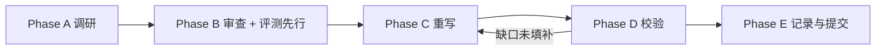

# 单个 skill 的五阶段流水线

每个 skill（首批与后续批次相同）必须依次完成 Phase A–E。结构与写作细节见
`docs/skill-standard.md`（下称「标准」）。



---

## Phase A 调研 → `research/<skill>.md`

用 `templates/research.md` 生成（`uv run tools/new_skill.py` 会一并创建）。

**候选数量下限 12**（多技能仓库内的单个 skill 也算一个候选）。检索途径：

- `web_search`：`"<topic> skill SKILL.md github"`、`site:skills.sh <topic>`
- <https://www.skills.sh> 搜索
- VoltAgent/awesome-agent-skills、addyosmani/agent-skills
- 领域官方组织仓库（`flutter/`、`dart-lang/`、`shadcn-ui/`、`vercel-labs/` 等）
- `github/awesome-copilot`（GitHub 官方，418 个 `skills/*/SKILL.md` + 193 个
  `instructions/*.instructions.md`；两者都可作 `paths`，后者按 Copilot instruction 文件读）
- 领域官方组织补充：`dotnet/`、`android/`、`google/`、`microsoft/`、`awslabs/`、`cloudflare/`、
  `hashicorp/`、`supabase/`、`redis/`、`mongodb/`、`elastic/`、`grafana/`、`getsentry/`、
  `apollographql/`、`expo/`、`callstackincubator/`、`laravel/`、`Unity-Technologies/`、`EpicGames/`

每个候选必须用 GitHub API 核对 stars / `pushed_at` / license：

```bash
gh api repos/<owner>/<repo> \
  --jq '{stars: .stargazers_count, pushed: .pushed_at, license: .license.spdx_id}'
```

**用已登录的 `gh`，不要用匿名 `curl`。** 匿名 API 只有 60 次/小时，一个 skill 的候选
复核就能打满；打满之后退化成读仓库网页猜数字，候选表就只能标 `unverified`。
`gh` 带用户自己的 5000 次/小时配额，无需手工传 token。**`gh auth status` 失败或 `gh` 限流时
停止该 skill 的 Phase A 并上报**——不得退回匿名 API 或读网页猜数字来填候选表。
必须读原始 `SKILL.md` 再评分。

候选表列：

```
# | 仓库/路径 | URL | Stars | 最近推送 | 许可 | 范围 | 权威 | 新鲜 | 具体 | 正确 | 许可分 | 总分 | 结论 | 理由
```

**REJECT 的候选也必须留行并写理由**——避免后续批次反复讨论同一个候选。

评分量表见标准第 9 节。

---

## Phase B 审查与挑选（含评测先行）

1. 对总分前 5–8 名通读 `SKILL.md` + 浏览 `references/`。
2. 写「深度审查」节：结构、frontmatter、质量、agent 绑定、与其他候选的重叠。
3. 写「冲突与裁决」节：按「官方厂商 > 公认专家 > 社区」「更新 > 更旧」裁决，对照官方文档核实。
4. 写「最终合入清单」：每个上游贡献什么、`relation` 是 `merged` 还是 `reference`。
5. **生成骨架**：

   ```bash
   uv run tools/new_skill.py <name> --category <platform|framework|task|meta>
   ```

6. **评测先行**：写 `skills/<name>/evals/evals.json`（≥3 场景，含 ≥1 负例，见标准第 6 节）
   与 `evals/files/` 夹具。
7. **跑无 skill 基线**：

   ```bash
   uv run tools/run_evals.py <name> --baseline
   ```

   逐条记录哪些 `expected_behavior` 未达成——这就是 skill 要填补的缺口，写进
   「基线缺口」节。**若基线全部达成，说明评测没有区分度，改写评测直到出现缺口。**

   评测模型固定为 **Claude Opus 5、medium 思考**（`tools/run_evals.py` 的默认值）；
   基线与「有 skill」都用它，两次运行才可比。

---

## Phase C 重写

在 Phase B 生成的骨架上按标准写 `SKILL.md` 与 `references/`。

- 脚本按需重写并**在本机跑通**（不能跑通的平台在正文注明，如「仅 macOS」）。
- 填 `SOURCES.yaml`；commit 字段用工具自动取 HEAD 写入：

  ```bash
  uv run tools/check_upstream.py --pin <skill>
  ```

---

## Phase D 校验

### D1 静态

```bash
uv run tools/validate_skills.py skills/<name>
```

安装冒烟：

```bash
rm -rf /tmp/hs-smoke && mkdir /tmp/hs-smoke && cd /tmp/hs-smoke
npx skills@latest add /root/Projects/Ling/HyperSkills --skill <name> \
  --agent universal --copy --yes
```

确认 `/tmp/hs-smoke/.agents/skills/<name>/SKILL.md` 与 `references/` 完整。

### D2 行为评测

```bash
uv run tools/run_evals.py <name>                  # Claude Opus 5 medium，有 skill
```

基线已在 Phase B 用 `--baseline` 跑过，模型相同。逐条对照 `expected_behavior` 人工判定
达成 / 未达成，负例场景确认 `skill_read == false`。

**通过标准**：至少一条基线未达成的行为在有 skill 时达成。否则回到
Phase C 修改——缺口未被填补 = skill 无效。

结果写入 `research/<skill>.md`「评测结果」节：

```
| 场景 | 模型 | 有/无 skill | skill_read | 达成的 expected_behavior | 备注 |
```

### 交互式开发（可选）

在仓库根目录 `.omp/config.yml`（已 gitignore）写入：

```yaml
skills:
  customDirectories: ["./skills"]
```

使本仓库 skill 在本目录会话中被发现。键名以 `omp config get skills.customDirectories` 为准。

---

## Phase E 记录与提交

1. MCP `record-agent-log`：做了什么 + **为什么**（选了谁、拒了谁、冲突怎么裁）。
2. 提交一次：

   ```
   feat(skills): ✨ 新增 <name> skill

   Co-authored-by: Wine Fox <fox@ling.plus>
   ```

3. push。

---

## 更新流程

```bash
uv run tools/check_upstream.py [<skill>...]
```

先用 GitHub 的 compare 端点确定 `pinned..HEAD` 这个提交集合，再看该区间改了哪些文件，
最后才把文件归到 `paths` 上。**顺序不能反**：pinned 是同步时的仓库 HEAD，它通常并不修改
目标路径，所以按路径过滤的历史里根本不会出现它——以它为哨兵去截断，会把该路径 pin 之前的
全部历史都当成新增。

状态含义：

| 状态 | 含义 | 要做什么 |
|---|---|---|
| `up to date` | HEAD == pinned commit | 无 |
| `repo moved, tracked paths unchanged` | 区间内有提交，但没碰 `paths` | 无。大型 monorepo（`vercel/next.js`、`nexu-io/open-design`）每天都在动，`paths` 的作用就是滤掉这些噪声 |
| `behind` | `paths` 下确有新提交，**或**无法确认（限流 / diff 超过 compare 上限 / 未声明 paths） | 看 `note:` 那行说明是哪种；确有变更就读变更文件 |
| `diverged` | `ref` 已不再包含 pin | 上游改了分支策略，按 Phase B 重新裁决 |
| `pinned commit is unreachable` | pin 在 `ref` 上找不到 | 上游 force-push 或重写了历史，重新审阅并重新 pin |
| `MISSING` | 仓库 404 | 上游被删或改名，按 Phase B 重新裁决 |
| `manual check` | `kind: docs` | 人工打开链接比对 |

传输按配额优先级自动选择：已登录的 `gh api`（5000 次/小时）→ `GITHUB_TOKEN` → 匿名
（60 次/小时）。都不可用时 `git ls-remote` 仍能取到 HEAD，但**取不到按路径的历史**，
此时一律报 `behind`——**不知道是否变更**不能说成**未变更**。同理，compare 的
文件列表上限 300、提交列表上限 250，超出即视为无法归因，也报 `behind`。

`HYPERSKILLS_GITHUB_API` 可覆盖 API 根地址（GitHub Enterprise，或指向本地夹具服务）。

`paths` 下确有变更时：

1. 重读变更文件，按 Phase B 的裁决规则更新内容。
2. `uv run tools/check_upstream.py --pin <skill>` 更新 `commit` / `synced_at`。
3. 把 `SKILL.md` 的 `metadata.version` 与 `SOURCES.yaml` 的 `version` 改为当天。
4. 重跑 Phase D。
5. 提交 `chore(skills): ⬆️ 同步 <name> 上游 <id>`。
