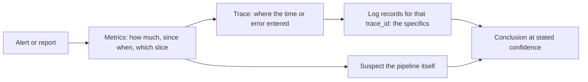

# Triage from production signals

This reference is for the case where the failure exists only in production: the alert fired, the
customers noticed, and nothing reproduces on a developer machine or in staging.

## Contents

- [The order of operations](#the-order-of-operations)
- [Step 1 — inventory the signals](#step-1--inventory-the-signals)
- [Step 2 — scope and timeline from metrics](#step-2--scope-and-timeline-from-metrics)
- [Step 3 — locality from a trace](#step-3--locality-from-a-trace)
- [Step 4 — specifics from log records](#step-4--specifics-from-log-records)
- [When the join keys are missing](#when-the-join-keys-are-missing)
- [Suspect the telemetry pipeline](#suspect-the-telemetry-pipeline)
- [Confidence language](#confidence-language)
- [Closing the loop](#closing-the-loop)
- [Worked shape](#worked-shape)

## The order of operations

Metrics scope it, traces locate it, logs explain it. Running that order backwards — starting from
a log search — is the most reliable way to spend an hour learning nothing, because a log stream
gives no sense of proportion: a dozen alarming lines look identical whether they represent 0.01%
or 40% of traffic.



## Step 1 — inventory the signals

Before theorising, establish what is actually available. Half of all wrong conclusions in an
incident come from assuming a signal is complete when it is sampled, aggregated or absent.

- Which metrics exist for the affected path, and are any of them not reporting right now?
- Do the log records carry `trace_id`, or only a pod name and a timestamp?
- How much of the trace volume survived sampling, and what was the policy?
- Are there exemplars linking metric samples to traces?
- Do the resource attributes agree across signals, so the same service can be identified in all
  three?

Write the gaps down. They are both a constraint on what can be concluded now and the list of
things to fix afterwards.

## Step 2 — scope and timeline from metrics

Four questions, in order, all answerable from RED metrics:

1. **When did it start?** A step change or a ramp, and whether it aligns with a deploy, a config
   change, a traffic shift or a dependency's own incident.
2. **How much of the traffic?** An error ratio, not a count. "6% of checkouts" and "190,000
   requests" are the same fact, but only the first tells you whether to page.
3. **Which slice?** Break down by route, status class, version, tenant, region, instance. A
   failure confined to one version is a deploy; confined to one instance is that host; spread
   evenly is a shared dependency.
4. **Did it recover, and how?** Self-recovery points at something transient or upstream —
   saturation that drained, a dependency that healed, a bad instance that was replaced.

Resist reading a cause out of the timeline. Correlation with a deploy is strong evidence and not
proof; two things often change at once.

## Step 3 — locality from a trace

Get into a trace by the cheapest available route: an exemplar on the metric sample, a `trace_id`
from a log record, or a trace search filtered to the affected service, route and status.

Read the trace for **locality**, not for a root cause:

- Where did the wall-clock time go — which span, and was it waiting or working?
- Where did the error first appear, and what did the spans above it do with it (retry, fall back,
  propagate)?
- Are there gaps between spans? A gap is time inside the process that nothing instrumented, which
  is itself a finding.
- Does the trace end where a boundary is? Then context propagation broke and the rest of the
  request is in a different trace.

A slow database span means the query took that long. It does not say whether the database was
slow, the connection pool was exhausted, or a neighbour saturated the disk — those are three
different fixes, and distinguishing them needs the database's own signals.

## Step 4 — specifics from log records

With a `trace_id`, filter the log records to exactly that request. This is where the specifics
live: which parameter, which upstream, which error class, which retry attempt.

Look for the things a span attribute could not hold: the exception type and stack trace, the
sequence of retries and their individual failures, the branch the code took, the value that was
out of range.

Then check the same event name across the window rather than the single request — one instance
tells you what happened, the aggregate tells you whether it is the pattern.

## When the join keys are missing

The realistic case. Log records with no `trace_id`, metrics with no exemplars, and a handful of
sampled traces. What is still possible, in decreasing order of usefulness:

1. **Join on time plus a coarse dimension.** Pod, instance or host, at second resolution. This
   works when concurrency per pod is low and degrades to guessing when it is not.
2. **Join on a business identifier** that happens to appear both in a log message and in a span
   attribute — an order number, an account. Fragile, but it often rescues a single-customer
   report.
3. **Reason from the aggregate.** Error ratio by route by version, plus the shape of the recovery,
   supports a claim about *what class* of failure occurred without identifying any individual
   request.

What is not possible is reconstructing a specific request's path. Say so, rather than presenting a
timeline assembled from adjacent log lines as if it were one request — adjacency in an interleaved
stream is not causation, and that inference is where incidents acquire their wrong conclusions.

## Suspect the telemetry pipeline

Telemetry failures impersonate application failures. Check these before concluding anything about
the application:

| Observation | Could be the pipeline |
|---|---|
| A metric stopped reporting | The series exploded and the store is rejecting or OOMing; or the exporter queue is full |
| Error rate dropped to zero during the incident | Records are being dropped under load, not requests succeeding |
| `rate()` returning absurd values | A distinguishing label was removed somewhere, merging counter resets |
| Far fewer traces than the error count implies | Sampling — rate, policy, or `decision_wait` expiring before the slow spans arrive |
| Traces stop at a boundary | Context propagation, not a service that stopped being called |
| Everything from one service is missing | Resource identity overwritten, a receiver bound to loopback, or auth failing at the exporter |
| Latency improved at the same moment as an incident | Slow requests timing out before they are recorded |

The Collector's own metrics settle most of these quickly: `otelcol_receiver_refused_*` means
backpressure, `otelcol_exporter_send_failed_*` means the downstream is rejecting, and a queue at
capacity means the exporter cannot keep up. A store that was OOM-killed twice this week is a
prime suspect for any "the data is missing" claim.

## Confidence language

Separate three categories explicitly, because conflating them is how an incident review ends up
fixing the wrong thing:

- **Established** — the signals show it directly. "The error ratio went from 0.2% to 6.1% at
  14:07 and returned at 14:48."
- **Consistent with** — the signals do not contradict it and it explains them. "The log message
  says upstream timeout and the recovery was self-driven, which is consistent with the provider
  degrading."
- **Not determinable from what exists** — and name the signal that would settle it. "Whether every
  failure was the same upstream cannot be determined: eleven traces survived sampling and the log
  records carry no `trace_id`. Trace correlation on log records would settle it."

A stated gap is a complete answer. Filling it with a plausible root cause is not — it produces a
fix for a hypothesis and leaves the real cause in place for the next occurrence.

## Closing the loop

Two outputs, both required, and the second is the one usually skipped:

1. **The fix for the failure**, at whatever confidence the signals support.
2. **The fix for the observability gap** that made the investigation slow. Name the specific
   change — `trace_id` on log records, an exemplar on the latency histogram, a longer
   `decision_wait`, a metric that never existed — and the query an on-call engineer would run next
   time.

If no alert caught the symptom, add one, on the symptom rather than the cause. If an alert fired
but nobody acted, that is an alert-quality problem, not a response problem.

Where the failure turned out to be reproducible after all, the work moves out of this skill: use
the `debugging` skill for the local reproduction, and keep the observability fix here.

## Worked shape

A compact example of the output this produces, on a self-recovering error spike with sparse
signals:

```
Established
- Error ratio 0.2% -> 6.1% at 14:07, recovered 14:48, no deploy in the window.
- Confined to POST /api/orders/:id/pay; other routes unaffected.
- Prometheus was OOM-killed twice on 2026-08-17; checkout_latency has not reported for 3 days,
  so latency during the incident is unmeasured.

Consistent with
- Payment provider degradation: every sampled error trace fails at the provider CLIENT span,
  and the log message is "upstream timeout".

Not determinable
- Whether all 190k failures share that cause. 11 traces survived a 5% baseline with
  decision_wait: 5s, and log records carry no trace_id, so no per-request attribution exists.

Observability fixes, in order
1. trace_id/span_id on every log record - restores the log-to-trace pivot.
2. decision_wait above the upstream timeout - stops force-deciding exactly the slow traces.
3. Remove user_id/order_id from payment_attempts and checkout_latency - that is the OOM.
4. Alert on the error ratio with a burn-rate rule; the count-based rule fired late.
```

<!-- sources: addyosmani-agent-skills, grafana-skills, dash0-agent-skills, ollygarden-otel-skills, o11y-dev-otel, rampstack-monitoring, otel-collector-contrib -->
