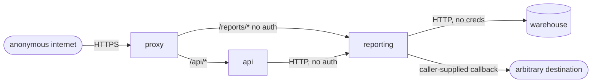

# Threat modelling a repository

Verified against: OWASP Top 10 2025, ASVS 5.0.0

## Contents

- [What makes a model useful](#what-makes-a-model-useful)
- [Step 1 — inventory](#step-1--inventory)
- [Step 2 — boundaries as edges](#step-2--boundaries-as-edges)
- [Step 3 — attacker capabilities, and non-capabilities](#step-3--attacker-capabilities-and-non-capabilities)
- [Step 4 — STRIDE, applied per edge](#step-4--stride-applied-per-edge)
- [Step 5 — rank with likelihood and impact apart](#step-5--rank-with-likelihood-and-impact-apart)
- [The assumption register](#the-assumption-register)
- [Diagramming](#diagramming)
- [Worked shape](#worked-shape)
- [Failure modes](#failure-modes)

## What makes a model useful

A threat model earns its keep when it changes what gets built or fixed next. Two properties
decide that: every claim is anchored to something in the repository, and every assumption that
moves the ranking is written down where a reader can dispute it.

The order matters. Inventory, then boundaries, then STRIDE per boundary. Starting from STRIDE
produces a list of the six categories restated at the system, which is a vocabulary exercise.

## Step 1 — inventory

Before any threat: components, data stores, external integrations, how the thing runs, and
its entry points — all cited to a file, a manifest or a deployment definition. Then assets, and
be concrete about what makes each one worth attacking:

| Asset class | Examples | Why an attacker wants it |
|---|---|---|
| Credentials | Session cookies, API tokens, service-account keys, deploy keys | Reuse elsewhere; persistence |
| Customer data | PII, payment details, documents, message content | Sale, extortion, cross-tenant reading |
| Integrity-critical state | Balances, entitlements, audit logs, feature flags | Fraud; hiding other activity |
| Build and release authority | CI credentials, registry push rights, signing keys | Reaching every downstream consumer |
| Availability-critical components | Shared queues, single-writer databases, rate limiters | Denial; or forcing a fail-open path |
| Compute | Anything that runs attacker-influenced code | Mining, lateral movement, egress |

Mark anything you inferred as inferred. A component nobody can point at in the tree is not part
of the model.

## Step 2 — boundaries as edges

A trust boundary is not a box around a service; it is an edge between two principals where the
trust level changes. Write one row per edge, and annotate every column — the empty cells are
the findings:

| From → To | Protocol | Authentication | Authorization | Encryption | Validation | Rate limit |
|---|---|---|---|---|---|---|
| Browser → api | HTTPS | Signed session cookie | Per-route | TLS at the proxy | Schema at handler | Per IP |
| api → reporting | HTTP | none | none | none | none | none |
| reporting → warehouse | HTTP | none | n/a | none | none | none |
| Proxy → reporting | HTTPS | none | none | TLS at the proxy | none | none |

Then look for the contradiction between what one side guarantees and what the other assumes.
The highest-value output of this step is usually not a missing control but an **invalidated
assumption**: a service documented as private that a proxy rule exposes, a consumer that trusts
a queue any tenant can publish to, an internal endpoint whose only authorization is a header
the client sets. When the document and the deployment disagree, the deployment wins, and the
threat model says so explicitly.

Two more edges are routinely omitted:

- **Data at rest as a boundary.** Two tenants sharing a table with no row-level security, or a
  bucket with one prefix per tenant and no policy enforcing the prefix, is an edge with no
  control on it.
- **The observability path.** Logs, traces and error reports carry data across a boundary into
  a system with a different — usually wider — audience.

## Step 3 — attacker capabilities, and non-capabilities

State what each attacker can do, and then state what they cannot. The non-capabilities are what
keep severity honest:

```
Anonymous internet
  can:    reach /api/* and /reports/* through the public proxy; register an account
  cannot: read the private subnet directly; read CI secrets; alter the deployed image

Authenticated tenant user
  can:    everything above, plus hold a valid session and a tenant id
  cannot: obtain another tenant's session; write to the warehouse directly

Compromised dependency (install-time)
  can:    run code in CI with CI's credentials
  cannot: reach production data unless CI credentials do
```

An unstated worst-case attacker inflates every severity in the report. If an attacker
capability is an assumption rather than an observation, it belongs in the assumption register,
not in the capability list.

## Step 4 — STRIDE, applied per edge

Walk the six categories against each edge, not against the system. Most edges yield nothing for
most categories; that is the point — it is a search, not a template to fill.

| Category | The question at this edge |
|---|---|
| Spoofing | Can the caller claim an identity it does not have? Unverified header, forgeable token, missing signature check |
| Tampering | Can it modify data or state it should not? Missing integrity check, mass assignment, unvalidated cursor |
| Repudiation | If it happened, would anyone be able to tell? Reads unlogged, admin actions unlogged, logs mutable by the actor |
| Information disclosure | Can it read data belonging to another principal? Missing ownership check, over-broad response, error text, log content |
| Denial of service | Can it make the service unavailable or force a fail-open path cheaply? |
| Elevation of privilege | Can it act as a higher-trust principal? Role from client input, admin route without a role check, token minted with the wrong audience |

Where the audit uses the OWASP Top 10 as a completeness check instead, use the 2025 numbering:
A01 Broken Access Control, A02 Security Misconfiguration, A03 Software Supply Chain Failures,
A04 Cryptographic Failures, A05 Injection, A06 Insecure Design, A07 Authentication Failures,
A08 Software or Data Integrity Failures, A09 Security Logging and Alerting Failures,
A10 Mishandling of Exceptional Conditions. `[official]`

Note the two traps for anyone carrying over older habits: SSRF is no longer a standalone
category — CWE-918 sits inside A01:2025 — and Injection moved from A03:2021 to A05:2025 while
A03 became supply chain. A citation without a year suffix is ambiguous and usually wrong.

For chapter-level coverage, ASVS 5.0.0 renumbered against 4.0.x: V1 Encoding and Sanitization,
V2 Validation and Business Logic, V3 Web Frontend Security, V4 API and Web Service,
V5 File Handling, V6 Authentication, V7 Session Management, V8 Authorization,
V9 Self-contained Tokens, V10 OAuth and OIDC, V11 Cryptography, V12 Secure Communication,
V13 Configuration, V14 Data Protection, V15 Secure Coding and Architecture,
V16 Security Logging and Error Handling, V17 WebRTC. `[official]` Citing "ASVS V4 Access
Control" at a 5.0 reader points them at API and Web Service; authorization is V8.

## Step 5 — rank with likelihood and impact apart

Give each threat a likelihood and an impact separately, each with a one-line justification,
then an overall priority. Keeping them apart is what makes the ranking arguable:

- Likelihood: exposure of the entry point, attacker capability required, whether a control
  partially blocks it, whether it needs a race or a specific state.
- Impact: what is demonstrably reachable — this record, this tenant, all tenants, this
  credential, code execution as this identity.

Overall priority never exceeds demonstrated impact. "Could theoretically lead to full
compromise" is not an impact; it is a hypothesis with no evidence attached.

Then name the one assumption whose reversal would most change the ranking. That sentence is
often the most valuable line in the document.

## The assumption register

Every model rests on facts the repository cannot settle. List them with what changes if each is
wrong:

| Assumption | Basis | If wrong |
|---|---|---|
| The `/reports/*` proxy rule is live | Present in the architecture notes | If removed, the reporting findings drop from pre-auth to internal-only |
| IMDSv1 is enabled on this cluster | Stated in the notes, not verified | If disabled, the SSRF chain loses its credential-theft step |
| Sessions are single-tenant | Inferred from the cookie shape | If a session spans tenants, every ownership check must also compare tenant |

Mark conclusions that depend on an unresolved assumption as conditional. Do not present the
inference as a fact, and do not drop the threat because the fact is unavailable.

## Diagramming

ASCII or mermaid only. Keep it to the boundaries; a diagram that reproduces the module graph
communicates nothing about trust.



## Worked shape

One threat, at the level of detail that makes it actionable:

```
T-03  Unauthenticated report resume reaches pickle.loads
  edge        proxy → reporting  (/reports/* rule, no authentication)
  principal   anonymous internet
  asset       compute and the reporting-service IAM identity
  path        POST body .cursor → base64 decode → pickle.loads (report_service.py:38)
  likelihood  high — single unauthenticated request, no state required
  impact      high — code execution as the reporting service, which holds s3:* on *
  priority    critical
  depends on  the /reports/* proxy rule being live (assumption A1)
  mitigation  a signed, versioned cursor, or JSON with an explicit schema; the pickle
              path deleted rather than guarded
```

## Failure modes

- **A STRIDE table with no repository references.** If a threat cannot name a component and an
  edge from the inventory, delete it.
- **Everything is high.** Usually means impact was assigned from the worst imaginable attacker
  rather than the demonstrated one.
- **Controls listed as present because the framework has them.** A control is present when the
  code path in question uses it; grep for the middleware on the route, not for the import.
- **CI and developer tooling mixed into the runtime risk list.** Different attacker, different
  impact; keep them in separate sections.
- **A model that ends without questions.** If nothing would change the ranking, the model was
  not grounded in anything uncertain, which means it was not grounded in the system.

<!-- sources: openai-threatmodel, copilot-threatmodel, cloudflare-audit, owasp-top10, owasp-asvs -->
