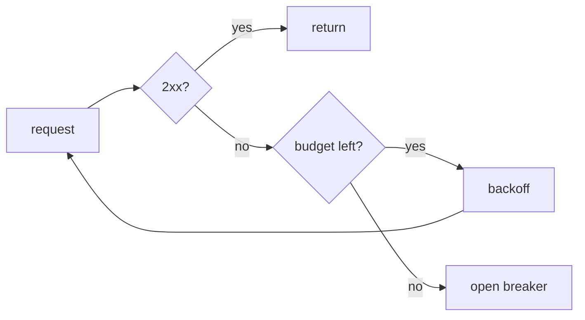

<div align="center">
  <picture>
    <source media="(prefers-color-scheme: dark)" srcset="docs/logo-dark.svg">
    
  </picture>
  <h1>harbor-fetch</h1>
  <p>Retrying HTTP client for Node with a per-host circuit breaker</p>
</div>

[](https://github.com/portside/harbor-fetch/actions/workflows/ci.yml)
[](https://www.npmjs.com/package/harbor-fetch)
[](LICENSE)

## Contents

- [Install](#install)
- [🚀 Quick start](#quick-start)
- [How retries work](#how-retries-work)
- [Options](#options)
- [Troubleshooting](#troubleshooting)

## Install

```sh
npm install harbor-fetch
```

> [!WARNING]
> Version 3 changed the default retry budget from 5 attempts to 3. Pin `^2` if
> you depend on the old default.

## 🚀 Quick start

```js
import { createClient } from "harbor-fetch";

const client = createClient({ retries: 3, breakerThreshold: 0.5 });
const res = await client.get("https://api.example.com/things");
console.log(res.status);
```

## How retries work




<video src="docs/breaker-demo.mp4" controls width="800"></video>

> [!NOTE]
> The breaker is per host, not per client instance.

## Options

<details>
<summary>All options</summary>

| Option | Default | Meaning |
|---|---|---|
| `retries` | `3` | attempts after the first failure |
| `breakerThreshold` | `0.5` | failure ratio that opens the breaker |
| `breakerWindowMs` | `10000` | rolling window for the ratio |
| `timeoutMs` | `30000` | per-attempt timeout |

</details>

## Troubleshooting

See [the troubleshooting guide](docs/troubleshooting.md) and the
[changelog](CHANGELOG.md).
