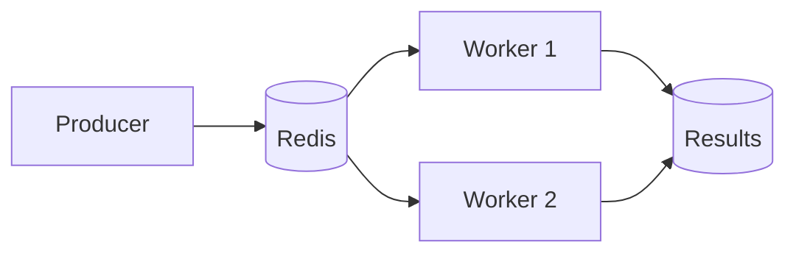

<a name="readme-top"></a>

<style>
  .hero { text-align: center; font-family: Inter, sans-serif; }
  .badge-wall img { margin: 2px; }
</style>

<div class="hero" style="text-align:center">
  <picture>
    <source media="(prefers-color-scheme: dark)" srcset="assets/hero-dark.png">
    <source media="(prefers-color-scheme: light)" srcset="assets/hero-light.png">
  </picture>
</div>

<center>
  <h1 class="hero" style="font-size:64px">✨ NEBULA QUEUE ✨</h1>
  <marquee behavior="scroll" direction="left">the last task queue you will ever need</marquee>
</center>

<div class="badge-wall" align="center">

[](https://github.com/orbitlabs/nebula-queue/actions)
[](https://pypi.org/project/nebula-queue/)
[](https://pypi.org/project/nebula-queue/)
[](https://codecov.io/gh/orbitlabs/nebula-queue)
[](LICENSE)
[](https://github.com/orbitlabs/nebula-queue/stargazers)
[](https://github.com/orbitlabs/nebula-queue/network/members)
[](https://github.com/orbitlabs/nebula-queue/issues)
[](https://github.com/orbitlabs/nebula-queue/pulls)
[](https://github.com/orbitlabs/nebula-queue/commits/main)
[](https://github.com/orbitlabs/nebula-queue/pulse)
[](https://github.com/orbitlabs/nebula-queue/graphs/contributors)
[](https://discord.gg/nebulaq)
[](https://hits.dwyl.com/orbitlabs/nebula-queue)
[](https://github.com/orbitlabs)
[](https://python.org)
[](https://redis.io)

</div>

<p align="center">
  
</p>

<video src="assets/demo.mp4" controls width="900"></video>

## 📖 Table of Contents

- [About](#about)
- [🚀 Quick Start](#quick-start)
- [📦 Installation](#installation)
- [⚙️ Configuration](#configuration)
- [🏗 Architecture](#architecture)
- [👥 Contributors](#contributors)
- [📈 Star History](#star-history)

<p align="right">(<a href="#readme-top">back to top</a>)</p>

## About

Nebula Queue is a distributed task queue for Python. It stores tasks in Redis
and runs them in worker processes. Tasks are retried with exponential backoff
and results are kept for a configurable time.

<p align="right">(<a href="#readme-top">back to top</a>)</p>

## 🚀 Quick Start

<details open>
<summary>Click to expand</summary>

```python
from nebula_queue import Broker

broker = Broker("redis://localhost:6379/0")

@broker.task
def resize(path):
    return path.upper()

resize.delay("cat.png")
```

</details>

<p align="right">(<a href="#readme-top">back to top</a>)</p>

## 📦 Installation

<details open>
<summary>Click to expand</summary>

```
pip install nebula-queue
```

</details>

See [the quickstart](docs/quickstart.md) and [the configuration reference](docs/configuration.md).

<p align="right">(<a href="#readme-top">back to top</a>)</p>

## ⚙️ Configuration

| Option | Default | Notes |
|---|---|---|
| `NEBULA_URL` | `redis://localhost:6379/0` | broker URL |
| `NEBULA_RESULT_TTL` | `3600` | seconds |
| `NEBULA_CONCURRENCY` | `8` | worker processes |
| `NEBULA_RETRY_MAX` | `5` | attempts |

<p align="right">(<a href="#readme-top">back to top</a>)</p>

## 🏗 Architecture




See [the architecture notes](docs/architecture.md).

<p align="right">(<a href="#readme-top">back to top</a>)</p>

## 👥 Contributors

<a href="https://github.com/orbitlabs/nebula-queue/graphs/contributors">
  
</a>


<p align="right">(<a href="#readme-top">back to top</a>)</p>

## 📈 Star History

[](https://star-history.com/#orbitlabs/nebula-queue&Date)

<p align="right">(<a href="#readme-top">back to top</a>)</p>
